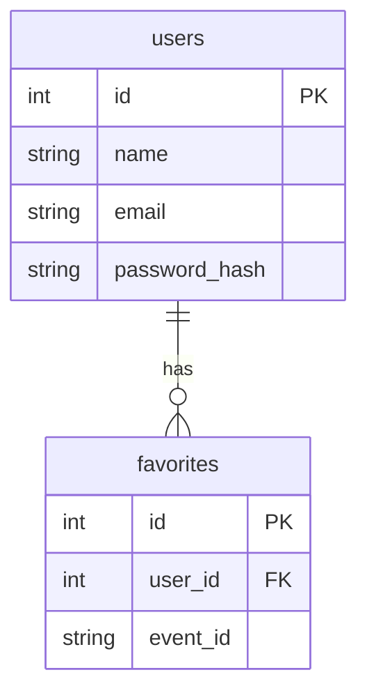

# Microservices - Produktionsumgebung

## Technologien

- Flask (https://flask.palletsprojects.com/en/3.0.x/)
- ApiFlask (https://apiflask.com/)
- SQLAlchemy (https://www.sqlalchemy.org/)
- mySQL (https://www.mysql.com/de/)
- Docker Compose (https://docs.docker.com/compose/)
- pyTest (https://docs.pytest.org/en/8.0.x/)
- Gunicorn (https://gunicorn.org/)
- Ticketmaster API (https://developer-acct.ticketmaster.com/)

## Zweck

Dies ist eine Anwendung eines dockerisierten Flask-Microservices mit angebundener externer Ticketmaster-API.
Sie umfasst sowohl eine Entwicklungs- als auch eine Produktionsvariante.

Ziel des Projekts ist es, ein Microservice mit REST-API, Nutzerverwaltung, externer Datenanbindung und CI/CD-Bereitstellung effizient zur Verfügung zu stellen.

## Funktionen

- Registrierung und Login von Benutzern  
- Suche nach Events über die angebundene Ticketmaster-API  
- Filterung von Events nach:
  - Genre
  - Stadt
  - Land
  - Datum (von–bis)  
- Speichern von Events als Favoriten durch angemeldete Nutzer  
- Anzeige aller favorisierten Events eines Nutzers  
- Weiterleitung zu externen Ticketseiten über Direktlinks

## Design



## Installation

Development Env (mit Hot Reload):

```bash
docker compose up --build
```

Tests ausführen:

```bash
docker compose -f compose.test.yaml up --build
```

Produktion:

```bash
docker compose -f compose.prod.yaml up --build
```
SSH connection EC (im Verzeichnis .ssh):

```bash
ssh -i "eventfinder-key.pem" ec2-user@ec2-54-156-170-152.compute-1.amazonaws.com
```

## CI/CD

Eine Konfiguration für Github-CI ist im Projekt angelegt. Damit die Pipeline funktioniert müssen folgende Variablen bei den Projekt- oder Gruppen-CI Secrets gesetzt werden:

- DEPLOY_TARGET - die IP-Adresse oder der DNS-Name des Ziel-Servers
- DEPLOY_TARGET_USER - der user, mit dem wir uns auf dem target server einloggen
- SSH_PRIVATE_KEY - der private SSH-Key des Servers (auf AWS EC2 normalerweise während der Erstellung generiert)
- DB_ROOT_PASSWORD - das Root Passwort der MySQL-Datenbank
- TICKETMASTER_API_KEY - Der API Key, welcher von der Externen Ticketmaster API zur Verfügung gestellt wird
- REGISTRY_USER - der Benutzername für die Container Registry (z. B. GitHub oder Docker Hub)
- REGISTRY_PASSWORD - das Passwort oder der Personal Access Token für die Container Registry
- REGISTRY_IMAGE - der vollständige Name des Docker-Images inkl. Registry und Namespace

